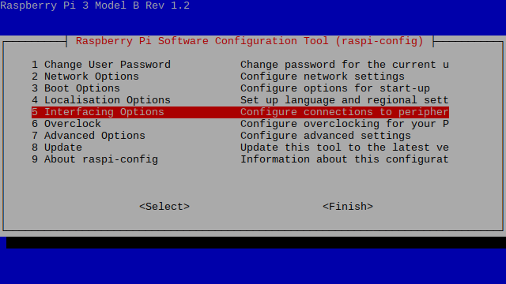

Instalação
**********

Este capítulo aborda os passos necessários para a configuração do Raspberry Pi e da instalação do *software* necessário para a utilização correcta do 8051 HAT.

Configuração do Raspberry Pi
============================

Para que se possam aproveitar ao máximo as potencialidades de comunicação entre o Raspberry Pi e o microcontrolador presente no 8051 HAT, será necessário habilitar o funcionamento dos portos SPI e I2C no RPi.

Para tal será necessário aceder ao menu de configuração do mesmo, neste caso, via linha de comandos:

.. code-block:: sh

    $ raspi-config

SPI
---

Aparecendo o seguinte menu:

Seleccionar a opção **5 Interfacing Options** usando as teclas de direcção.

.. image:: Images/spi_02.png
   :align: center

Escolher a opção **P4 SPI**, e confirmar a escolha.

.. image:: Images/spi_03.png
   :align: center

E obtemos a confirmação.

**Atenção!** - No final desta operação, o Raspberry Pi solicita se pretendemos efectuar um reboot para activar esta opção, responder *Não*, pois é ainda necessário efetuar a activação da interface I2C.

I2C
---

Para activar a interface I2C, seleccionar novamente a opção **5 Interfacing Options**

Agora escolher a opção **P5 I2C**, confirmar, e após resposta positiva à activação, então sim, permitir que o Raspberry Pi efectue um reboot para activar estas opções.

Instalação de software
======================

Para o desenvolvimento, simulação, compilação de programas para o 8051 e respectiva programação do microcontrolador, será necessário proceder à instalação de alguns programas no Raspberry pi:

* Sdcc
* MCU 8051 IDE
* AVRDUDE

Sdcc
----

O Sdcc (*Small Device C Compiler*) é um programa *open-source* que permite a compilação de programas em linguagem C para diversos tipos de microcontroladores de 8 bits.

Para a sua instalação, a partir da linha de comandos, ou se estiver no ambiente gráfico, abrir uma janela de terminal, e executar a seguinte instrução:

.. code-block:: sh

    $ sudo apt-get install sdcc

Para mais informações sobre o sdcc, podem aceder à `página do projecto <http://sdcc.sourceforge.net/>`_.

MCU 8051 IDE
------------

O MCU 8051 IDE é um ambiente gráfico de desenvolvimento intergrado para microcontroladores da família 8051. Tem um compilador de assembly próprio e um simulador integrado. Permite também o desenvolvimento de programas para o 8051 em linguagem C, através da integração com o *sdcc*.

No modo de *Debug*, o MCU 8051 IDE permite simular diversos tipos de hardware externo, tais como:

* Botões
* LEDs
* Matriz de LEDs
* Display de 7 segmentos simples e multiplexado
* Teclado matricial
* LCD de texto

O MCU 8051 IDE tem ainda um grande conjunto de utilitários que facilitam o desenvolvimento de programas e aplicações para o microcontrolador 8051.

A instalação do MCU 8051 IDE faz-se através da seguinte instrução:

.. code-block:: sh

    $ sudo apt-get install mcu8051ide

**NOTA:** Apesar da página oficial do projecto estar *off-line*, ainda se pode aceder à primeira versão da mesma no `Sourceforge <http://mcu8051ide.sourceforge.net/intro>`_.

AVRDUDE
-------

O AVRDUDE (*AVR Downloader/UploaDEr*) é um gravar/ler e manipular o conteúdo da ROM e EEPROM de diversos tipos de microcontroladores, e suporta uma grande variedade de programadores, incluíndo o interface SPI nativo do Raspberry Pi. Para instalar o AVRDUDE, basta executar o seguinte comando:

.. code-block:: sh

    $ sudo apt-get install avrdude

Embora o AVRDUDE seja descrito na sua `página <http://savannah.nongnu.org/projects/avrdude>`_ como um programa destinado a funcionar com microcontroladores AVR, pode também ser utilizado para microcontroladores da família 8051.

Por defeito, o AVRDUDE não suporta a programação do microcontrolador AT89S8253. Para adicionar a capacidade de programar este microcontrolador, será necessário editar o ficheiro *avrdude.conf.in* e acrescentar todos os dados necessários.
